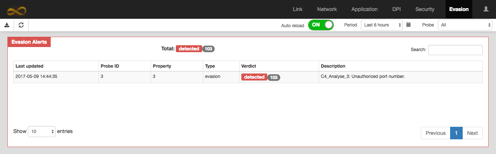

# Introduction

## Montimage Monitoring Tool

Montimage Monitoring Tool (MMT) is a monitoring solution that combines data capture, filtering and storage, events extraction and statistics collection, and traffic analysis and reporting, providing network, application, session, and user-level visibility. Furthermore, it is able to correlate information from different sources to detect complex events, and thanks to an advanced rule-based engine, propose counter-measures to react to detected situations (e.g., performance, security, operational incidents). MMT performs online and offline monitoring of the traces of a running system, and it allows the extraction of complex measurements from individual pieces of data. It is able to operate in a non-obstructive fashion, since the execution traces are observed without interfering with the behaviour of the system. 

MMT can be easily integrated with third parties in various ways: structured data produced by other applications or systems can feed the Extract module; extracted data and detected events can be used by other tools; behaviour models, pattern matching rules, etc. can be converted to properties to correlate information; and verdicts and events can be used by external tools. All these functionalities are summarized in the MMT global view presented in Figure belows.


## MMT-Operator

This document presents Graphical User Interface of MMT-Operator.

MMT-Operator is a Web application. It has typically 2 parts: Client (front end) and Server (back end). 

- **The Server** is written in NodeJS running at the server side. 
- **The Client** is written in JavaScript and HTML running on Web browsers at the client sides. There may be many users using their Web browsers to connect to the Server to statistics of MMT. 
These statistics will be graphically represented in Web browsers of users in forms of chart elements, such as, bar, line, pie, or table.
   This document presents in detail of the elements.

```
 --------------------                 -------------
|                    |               |             |<=====> Database
|      Client        | <==RESTful==> |   Server    |
| (HTML, Javascript) |               |  (NodeJS)   |<===== MMT-Probe(s)
 --------------------                 ------------- 

```

# General Structure

The followings are some basic notations being used in MMT:

- **Protocol** is a network protocol such as, IP, HTTP, NDN, etc.

- **Application** such as BitTorrent, Skype, etc. Contact us to get the full list of protocols and applications that have been supported by MMT.

- **Profile** is a group of protocols and/or applications. MMT-Operator has currently 13 profiles: Content Delivery Network, Cloud Storage, Conversational, DataBase, Direct Download Link, File Transfer, Gaming, Mail, Network, Peer to Peer, SocialNetwork, Streaming, Web.

- **Packet** is a term used in MMT to represent a data unit of a protocol. It is not restricted only for protocols at layer 3 of OSI. A packet consists of a **header** part and **payload** part. Header part contains control information that provides data for delivering the payload, for example: source and destination network addresses, error detection codes, and sequencing information. Payload part contains user data that may be  a packet of a higher protocol, e.g.,  payload of IP packet can be a TCP packet.

- **Micro Session** is a set of very small sessions. A session is considered as a micro one if its number of packets and data are less than some thresholds. MMT allows user to change easily these thresholds via a configuration file. Micro session will not be reported separately, rather, aggregated statistics from micro sessions will be reported together. Using micro sessions statistics reduces the report size. However, one will loose microscopic information about these micro session. 

- Network traffic are represented through 4 metrics:

    - **Data Volume** is size of data, in Bytes or Bits, of packets.

    - **Payload Volume** is size of payload part, in Bytes or Bits, of packets.

    - **Packet Count** is number of packets.

    - **Session Count** is number of TCP/IP sessions. Each session is differed by a 4-tuple (IP source, IP destination, Port source and Port destination).

The following things are applied on GUI:

- When a button is available, the cursor will be change to a pointer when moving over the button.

- The changing of display, such as, delete/resize a Report, reorder Report, etc., is only locally. It effects only the current Web browser.

## Tab

Statistics will be grouped into tabs, e.g., Link, Network, Application, DPI, Security, Evasion and Setting.

Each tab has a Toolbar and a set of Reports. The Figure below represents the Application tab having 3 reports: Top Users, Top Applications and Top Remotes.


## Toolbar

The toolbar often show the following buttons, from left to right:

1. **Export Charts to Images** : When click on this button, all displayed Reports will be exported to .png files. You might allow Google Chrome to download multiple files to download several report pictures.

2. **Delete a Report** : Drag and drop a Report over this button to delete that Report.

3. **Reset View** : Click on this button to reset the view of reports to the initial state.

4. **Auto Reload** : When it is enable, the current Tab is automatically reloaded periodically. 

5. **Period**  decides a period of statistic to shown, such as, the statistic of the last 5 minutes. The available periods are: Last 5 minutes, Last hour, Last 6 hours, Last 12 hours, Last 24 hours, Last 7 days, and, Last 30 days.

    One might also select a period between two dates by clicking on a small calendar button at the right of combobox.

6. **Probe**  lists all running MMT-Probe in the current Period. If there is only one MMT-Probe, this combobox has only one value "All". When more than one MMT-Probe is running, one might select the combobox to see the statistics of one or all MMT-Probes.


Please note that, one of the buttons above can be hidden on some specific Tabs.

## Report

A Report graphically represents a statistic of MMT.
A Report consist of:

1. **A title** located on the top-left corner

2. **One or many Filters** to filter out unnecessary data. When user changes value of a Filter, the other Filters and Charts will be reloaded.

3. **One or many Charts** is the main part of a Report. A Chart might depend on another, e.g., when an element in a Chart is selected another Chart will be reloaded to show the statistic concerning to the selected element.

One can do the following actions on Report:

1. **Delete a Report**: This action is available when there are more than one Report on a Tab. In such a case, there exists a RecycleBin icon on the left of Toolbar.

    To delete a Report, click and hold on the title of the report, then drag and drop it on the RecycleBin icon.
    
2. **Resize a Report**: To resize a Report, move cursor to an edge of Report, then drag cursor to resize it. Some Reports cannot be resized.

3. **Reorder Reports in a Tab**: To reorder Reports, drag and drop a Report to a position by click and hold on its title.

4. **Save a Report as a Picture**: Click on the left button on the Toolbar.

## Chart


# Tab Link

This tab gives an overview of the network being monitored by MMT-Probes, such as,
Input/output traffic, the top 7 protocols having highest traffic, list of active nodes since the last 5 minutes. On each report, one can click on detail button  to view bandwidth of an individual such as a protocol or a node.


Tab link consists of 3 reports:

1. **Traffic** represents the total bandwidth of the network represeting via 3 lines: in-bound and out-bound of IP traffic, along with the total bandwidth of other traffic that are non IP based protocols such as ARP.
    
    One can click on a legend item  to hide/unhide the line corresponding.

2. **Top Protocols** contains the top 7 protocols. This reports consists of 2 charts: the left one represents historical bandwidth, in bit per second, of the top protocols; the right one is the list of these protocols along with their total data and percentage.

    One can click on one item of the list to hide/unhide the line corresponding on the left side.

3. **Active Nodes** contains the information about the nodes in the network that are being active since the last 5 mintues. A node in a network is identified by its unique media access control address (MAC address).
    
    This report is not influenced by the Period filter on the toolbar. It always show the active nodes since the last 5 minutes or the moment started MMT if MMT has been started less than 5 minutes.
    
    Each row in the table represents a unique.
    Only the active nodes since the last minutes have statistical data. The statistic of the nodes, that were active since the last 5 minutes and inactive since the last minutes, are set to zero.
    
    The start time and the last updated time are respectively the first and latest moment MMT saw a packet coming/outgoing to this node

# Tab Network

This tab gives at the glance the top factors in the networks, such as, top users, top profiles, top locations, top links. These factors consume the most traffic. One can also inspect deeply one session.


Tab Network consists of first 4 reports. Each report contains the top 7 factors being represented in 2 charts: 

- The pie chart represents the pecentages of each factor.

- The table gives the detailed list of factors.

    For each row of the table,
    
    - Click on one color item, on the left, to hide/unhide the pie corresponding
    - Click on link name to inspect the detail of its factor
    - Click on  to show bandwidth used by its factor


1. **Top Users** is the top 7 users in the network. Each user is identified by an unique IP address.

2. **Top Profiles** is the top 7 Profiles in the network. When click on one profile name, one will get the top 7 applications or protocols of the profile.

3. **Top Geo Locations** is the top 7 destination countries. `_local` represents the traffic of 2 users in the network.

4. **Top Links** is the top 7 links. One link represents the traffic between 2 users in the network or one user with another from outside the network.

To inspect in detail of one session, one can click on name of each factor. 
For example, on can:

1. click on `Vietnam` in the Top Geo Location, 

2. then `Web` on the Profiles, 

3. then `HTTP:80` 

4. then `192.168.0.198 <-> 111.65.248.144`, 

then one obtains the following list:


# Tab DPI

Tab DPI gives information about hierarchy of protocols/applications. It consists of 1 Report: Protocol Hierarchy.


The Protocol Hierarchy report has 2 charts: a tree chart on the left and a line chart on the right.

- The tree chart represents the hierarchy of protocols, e.g., there are 36 distinct protocols/application in the figure above.

    - Click on  to collapse/expand the tree. 
    
    - Click on a hyper-link to select/deselect its protocol. When a protocol is selected, its traffic will be shown on the right chart
    
- The line chart represents the traffic of the selected protocols of the tree chart. These lines do not represent the bandwidth of the protocols but their total traffic during a sample period that is 5 seconds by default.

    Through this chart, one can easily see a consistency between protocols. For example, in the figure above, we found that the HTTP traffic vs the total traffic that is represented by ethernet.
    
# Tab Application

Tab Application shows the information about the network's round-trip time, data transfer time, application response time and data rate for the selected application type from the App tab. Moreover, the detailed information is provided in the tables for each application every 5 seconds, that are application response time, data transfer time, server data transfer time, client transfer time, network round-trip time, Number of HTTP transaction, number of active flows, packet rate, data rate, packet size and percentage of payload.

This Tab currently supports only protocols/applications on the top of HTTP and FTP.


- **FTP Response Time** is the time elapsed between a client sending a request to a FTP server and receiving the response packet. The response time includes the 3 way TCP handshake.

- **HTTP response Time** is the time elapsed between a client application sending a request (GET) to a HTTP server and receiving the response packet.

Initial TCP RTT (Handshake): Initial RTT  of an application is determined by looking at the TCP Three Way Handshake. It is the time elapsed between TCP-SYN and TCP-ACK in the TCP Three Way Handshake. 

- **NRT**, Network Response Time, is mesured by a TCP handshake.

- **ART**, Application Reponse Time,

- **DTT**, Data Transfer Time,

- **#HTTP Trans** is the number of HTTP transitions. An HTTP transition is counted from starting a request to receiving completely its response. Different HTTP transitions can perform through only one TCP/IP session.

- **#Flows** indicates the number of TCP/IP sessions.

- **Pkt rate (pps)** indicates the average number of packets received per second

- **%Retrans.** is the percentage of number of packets being retransmitted

- **Data rate (bps)** indicates the average number of bits received per second

- **Packet size (B)** indicates an average packet size, in Bytes

- **%Payload** indicates the percentage of payload on the total data. When this percentage closes to 100%, 

# Tab Security and Evasion

Tab Security and Tab Evasion list all security alerts. The alerts are grouped by property and probe ID.
These tabs list only the lattest 5000 alerts.



Each tab has only one report consisting of one table. Each row of the table represents the alerts of one property.
One can click on one row to see the alerts as in the figure below.


# Tab Setting

Tab setting gives some statistic of server hosting MMT-Operator such as CPU usage, memory and hard driver free space. It also allows user to update setting of MMT-Operator, backup database.


Tab Setting consists of 4 reports.

1. **System Usage** gives a statistic of usage of the server on that MMT-Operator is running.

2. **Configuration** allows to:

    - update file `config.json` of MMT-Operator
    - update file `/etc/network/interfaces` of the server
    - view execution logs of MMT-Operator

3. **MMT-Probes** allows to manager MMT-Probe. One can install MMT-Probe on a remote server by giving permission to MMT-Operator to log on that server via SSH.

    When clicking on **Add new Probe** button, one is led to another window to enter SSH information of the remote server. After entering successfully, MMT-Operator will install a new MMT-Probe on the server and add it to the list of management.
    
    For the existing MMT-Probe, one can:
    
    - stop/start a probe
    - update config file of a probe
    - uninstall a probe

4. **DataBase** 

    - **Save** button saves information in the form: Auto backup, FTP Server
    - **Empty DB** button empties database that contains MMT statistic. This does not change user information such as password, licence, and information in this tab.
    
        After clicking on the button, one need to confirm in another windows before MMT-Operator can empty its database.
        
    - **Backup now** button backups immediately database using the current setting. After clicking on the button, one need to confirm the action.
    
    - **Restore** button leads user to another window to select a backup image from a list of available ones to restore.
    
    
# Others

1. **Login**: Default login information are `admin`/ `mmt2nm` for username/password respectively.

2. **Change Password**: One can change the current password by clicking on  button, then "Change password".

3. **Update Licence**: One can update the licence by clicking on  button, then "Profile".